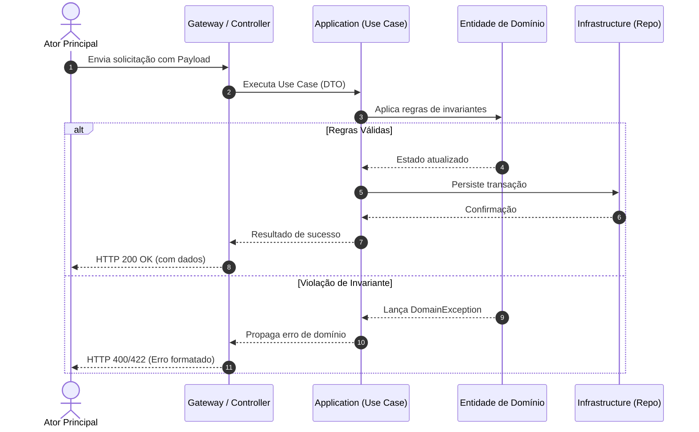
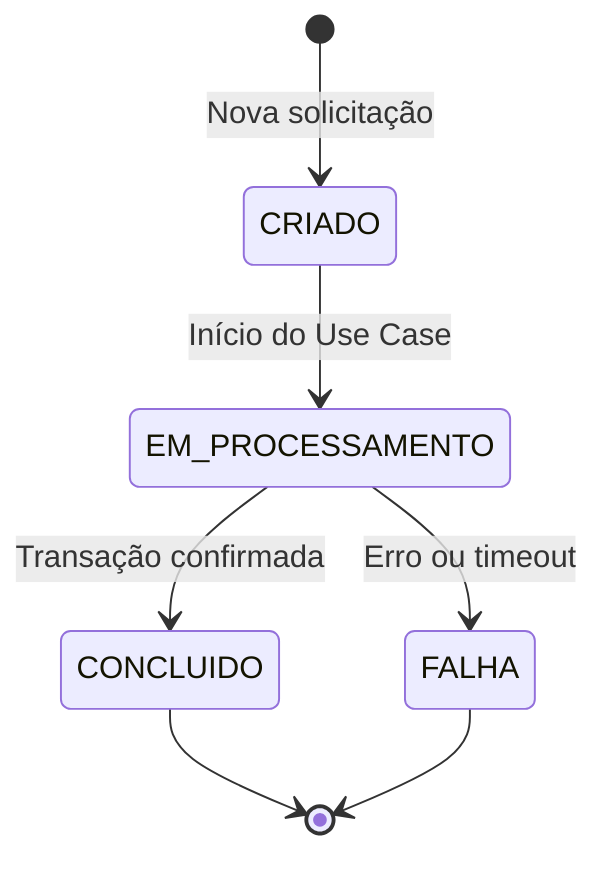

Navegação: [Projeto](file://../../../../../project/index.md) / [{{DOMAIN_TITLE}}](file://../../../../index.md) / [{{SUBDOMAIN_TITLE}}](file://../../../index.md) / [{{FEATURE_NAME}}](file://../index.md) / **Fluxo Gráfico**  
Status: `DRAFT` | Camada: `L4_ARTIFACT`

---

# Fluxo Lógico e Gráfico: {{FEATURE_NAME}}

## 1. Diagrama de Sequência

---

## 2. Diagrama de Estados da Entidade

---

### Navegação da Esteira

* **Etapa Anterior:** [04 - Definição Técnica](file://../feature-definition.md)
* **Próxima Etapa:** [05 - Modelagem de Entidades (Docs/Entity)](file://./entity.md)
* **Feedback Loop:** Se o fluxo estiver incompleto ou inconsistente, [retornar para Feature Definition](file://../feature-definition.md).
