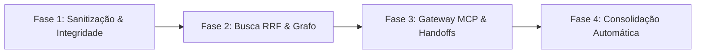

# 🧠 Análise Arquitetural: ai-memory & Oportunidades para o Project-Boilerplate

> **Documento de Referência Estratégica e Estado da Arte**  
> Mapeamento aprofundado de capacidades, padrões teóricos (Karpathy LLM-Wiki), lições aprendidas de concorrentes (Cognee, Basic-Memory, MemPalace, AgentMemory) e planos de convergência para o **Spec-Driven Governance System & AI-Context OS**.

---

## 🧭 1. O que é o ai-memory?

O **`ai-memory`** é um sistema robusto em Rust projetado para fornecer memória de longo prazo, contexto persistente e continuidade cross-session/cross-agent para ferramentas de desenvolvimento baseadas em IA (Claude Code, OpenAI Codex, Antigravity CLI, Cursor, Gemini CLI, OpenCode, etc.).

### Principais Invariantes Arquiteturais:
1. **Markdown no Git como Fonte da Verdade (*Source of Truth*):** Todo conhecimento durável vive em arquivos Markdown no disco versionados via Git (`libgit2`), com commits automáticos e atômicos a cada compilação/mutação.
2. **SQLite como Índice Derivado:** Banco de dados SQLite em modo WAL utilizado estritamente como índice de alta velocidade para busca lexical (FTS5), sessões, observações brutas, links entre entidades, handoffs e embeddings vetoriais.
3. **Compilação Contínua (*Karpathy-style Wiki Compiling*):** Filosofia de "compilar em vez de apenas recuperar". Observações efêmeras e contextuais de sessões são condensadas periodicamente em páginas oficiais de conhecimento durável (`concepts/`, `decisions/`, `gotchas/`, `procedures/`, `_rules/`).
4. **Fronteira Estrita de Sanitização:** Toda informação capturada por hooks passa por um sanitizador que remove segredos (chaves de API, tokens JWT, credenciais AWS/GCP, certificados) antes de qualquer persistência em disco ou banco.
5. **Busca Híbrida RRF (Reciprocal Rank Fusion):** Combinação de busca FTS5, casamento lexical de entidades, expansão por vizinhos no grafo de links e similaridade de cosseno vetorial, ponderados por multiplicadores de autoridade.
6. **Passagem de Bastão (*Session Handoffs*):** Registro formal do estado da sessão ao encerrar o trabalho de um agente, permitindo que outro agente (ou humano) retome o fluxo sem perda de contexto.

---

## 🏛️ 2. Fundamentos Teóricos: O Padrão "LLM-Wiki" de Karpathy
*(Referência: `docs/research-karpathy-llm-wiki.md`)*

O projeto é construído sobre a tese de Andrej Karpathy (abril/2026), que desafiou o modelo tradicional de RAG:
> *"A maioria das pessoas usa RAG: faz upload de arquivos brutos e a IA busca pedaços a cada pergunta. Isso funciona, mas a IA está redescobrindo o conhecimento do zero a cada vez. Não há acúmulo nem síntese."*

### Os 3 Postulados de Karpathy Implementados:
1. **Compilação na Ingestão, Não Síntese na Consulta (*Compile, Not Retrieve*):** O conhecimento deve ser processado, sintetizado e arquivado em formato oficial no momento da ingestão, e não re-sintetizado sob demanda a cada prompt.
2. **Arquitetura em 3 Camadas:**
   - **Fontes Brutas (Raw):** Logs, transcrições e outputs de ferramentas (imutáveis, somente leitura).
   - **Wiki Estruturada:** Arquivos Markdown interconectados (`concepts/`, `decisions/`, `gotchas/`, `procedures/`, `_rules/`) gerenciados pelo agente.
   - **Schema de Governança (`AGENTS.md` / `CLAUDE.md`):** Regras que transformam um chatbot comum em um mantenedor disciplinado de documentação.
3. **Links Cruzados como Síntese:** A estrutura de links entre páginas (o grafo de conhecimento) **é** o conhecimento consolidado. Uma nova ingestão toca e atualiza de 10 a 15 páginas relacionadas simultaneamente.

---

## 💀 3. Post-Mortem de Prior-Art: Lições de Falhas em Outros Sistemas
*(Referência: `docs/prior-art-implementation-findings.md`)*

O `ai-memory` documentou extensivamente os erros arquiteturais dos concorrentes para não repeti-los:

| Projeto Analisado | Onde Falhou / O que Quebrou | Decisão de Design Tomada no `ai-memory` |
| :--- | :--- | :--- |
| **Cognee** | Complexidade excessiva: tentou sincronizar 3 bancos ao mesmo tempo (Graph DB + Vector DB + Relacional), gerando deadlocks no SQLite e corrupção de estado. | **1 único arquivo SQLite** com WAL mode, onde o grafo é modelado com tabelas SQL simples e CTEs recursivas. Zero banco de grafo externo. |
| **Basic-Memory** | Exigia que o humano digitasse comandos manuais `write_note` (as pessoas esquecem) e usava file watchers frágeis com problemas de inode race. | **Captura 100% passiva e automática** via Lifecycle Hooks dos agentes (início de sessão, pós-ferramentas, fim de sessão). |
| **MemPalace** | Salvava todas as transcrições brutas para sempre sem expiração $\rightarrow$ índices vetoriais (HNSW/Chroma) inflaram e corromperam. | **Decaimento temporal de Ebbinghaus** com sweeps de limpeza periódicos (`expires_at`, tombstones e purge). |
| **AgentMemory** | Excesso de ferramentas MCP (50+ ferramentas no catálogo), confundindo o raciocínio e a escolha de ferramentas do LLM. | **Superfície MCP ultra-enxuta (Narrow Tools):** Apenas ~5 a 7 ferramentas essenciais de alto nível. |

---

## ⚡ 4. Mecânica de Busca Híbrida & Decaimento de Memória
*(Referência: `docs/ARCHITECTURE.md`)*

### A. Fórmula de Ranqueamento RRF (Reciprocal Rank Fusion)
O motor de recuperação não depende obrigatoriamente de vetores caros, operando com excelência mesmo em modo Zero-LLM:

$$\text{RRF Score}(d) = \sum_{m \in M} \frac{w_m}{k + \text{rank}_m(d)} \times \text{Authority Multiplier}(d)$$

Onde os canais $M$ incluem:
1. **FTS5 (Full-Text Search):** Correspondência lexical direta via SQLite FTS5.
2. **Entity Match:** Casamento exato de entidades declaradas no frontmatter (`entities: [...]`).
3. **Graph Neighbors:** Expansão de vizinhos conectados por wikilinks (`[[...]]`).
4. **Vector Cosine (Opcional):** Similaridade semântica se houver provedor de embedding configurado.
5. **Multiplicadores de Autoridade:** Decisões de arquitetura (`decisions/`) e regras oficiais (`_rules/`) possuem autoridade superior a logs passageiros.

### B. Ciclo de Vida e Decaimento (Ebbinghaus Decay)
- **TTL explícito (`expires_at`):** Notas temporárias são deletadas automaticamente no próximo sweep.
- **Score de Retenção:** Baseado em frequência de acesso e recência.
- **Tombstones:** Páginas frias são arquivadas como tombstones antes do purge definitivo.

---

## 🤖 5. Loop de Auto-Melhoria com Portões de Avaliação (*Eval Gates*)
*(Referência: `docs/auto-improvement-loop.md` e `docs/auto-improve-eval-gates.md`)*

Inspirado no loop do **Hermes Agent**, o sistema revisa sessões concluídas em segundo plano:
- **Execução não-concorrente:** O revisor roda fora da sessão de trabalho ativa do usuário para não competir por atenção ou poluir o contexto.
- **Área de Staging (`_pending/auto-improve/`):** Propostas de novas regras ou ajustes de conceitos são encenadas com justificativa, citações de evidência e score de confiança.
- **Portões de Avaliação Executáveis (*Eval Gates*):** Antes de uma proposta ser promovida a regra oficial, ela pode passar por um script validador executável JSON do projeto (ex: JSON Schema, linter, testes de invariante). Propostas inválidas são rejeitadas automaticamente.

---

## 🔄 6. Workstreams Gerenciados Cross-Harness (`ai-memory run`)
*(Referência: `docs/managed-workstreams.md`)*

Capacidade de alternar entre diferentes LLMs/IDEs mantendo a continuidade do raciocínio:
```bash
ai-memory run claude       # Inicia trabalho no Claude Code
# Interrompe o Claude...
ai-memory run codex --yolo # Continua no OpenAI Codex exatamente de onde o Claude parou
# Mais tarde...
ai-memory run antigravity  # Retoma no Antigravity CLI com o mesmo bastão de contexto
```
O servidor mantém o ledger da sessão e sintetiza o **Handoff** (o que foi feito, o que falta, armadilhas encontradas e arquivos tocados).

---

## 💎 7. Matriz de Sinergias: ai-memory vs. Spec-Driven Governance System

| Dimensão / Recurso | `ai-memory` | `project-boilerplate` (Spec OS) | Oportunidade de Extração / Convergência |
| :--- | :--- | :--- | :--- |
| **Formato Oficial** | Markdown + YAML Frontmatter | Markdown + YAML Frontmatter (L1 a L6) | Estruturas de metadados compatíveis. Enriquecer o frontmatter das specs com tags de autoridade, TTL e wikilinks. |
| **Relação de Conhecimento** | Grafo de links bidirecionais (`[[wikilinks]]`) | Árvore estrita (L1-L6) + Grafo Cross-cutting | Aplicar o algoritmo de expansão de vizinhos de grafo para injeção de contexto em LLMs. |
| **Persistência / Auditoria** | Git commits atômicos por batch de escrita | Edições no filesystem via Python `server.py` | Implementar commits Git atômicos após alterações de especificações pelo editor/chat. |
| **Recuperação de Contexto** | FTS5 + Lexical + Graph + Vetores (RRF) | Leitura de arquivos da árvore por caminho | Implementar busca com relevância RRF no `server.py` para alimentar o chat e a árvore. |
| **Segurança e LGPD** | Sanitizador tipado pré-gravação | Validações no backend HTTP | Adicionar rotina de higienização contra vazamento de credenciais e tokens em specs e chats. |
| **Integração com Agentes** | Protocolo MCP (`rmcp` 1.7) nativo | API REST + SSE via Web UI | Criar um servidor MCP no `server.py` para que IDEs (Cursor/Antigravity/Claude) consumam as specs diretamente. |
| **Transição de Sessão** | Handoffs de estado (o que foi feito, pendências) | Histórico de chat por feature/arquivo | Gerar cards de Handoff automático ao concluir sprints/tarefas de especificação. |

---

## 🛠️ 8. Módulos e Padrões de Alto Valor para o Boilerplate

### Pilar 1: Motor de Compilação Contínua (*Continuous Spec Compilation*)
* **Módulo de referência:** `crates/ai-memory-consolidate`
* **Aplicação no Boilerplate:**
  - O Chat do editor deixa de ser apenas um log de mensagens;
  - Ao final de uma sessão conversacional, um pipeline de consolidação extrai as decisões tomadas e atualiza o YAML Frontmatter (`critical_invariants`, `rules`, `bdd_scenarios`) do nó correspondente (L2, L3 ou L4).

### Pilar 2: Busca Híbrida RRF & Expansão de Grafo de Invariantes
* **Módulo de referência:** `crates/ai-memory-store`
* **Aplicação no Boilerplate:**
  - Quando a IA for gerar código ou validar uma feature, ela não consulta apenas o arquivo atual;
  - O motor de busca expande o nó pai (L3/L2) para carregar as invariantes de domínio e os nós com vínculos `cross_cutting_relations`, montando o contexto mínimo e exato necessário sem estourar o limite de tokens.

### Pilar 3: Sanitizador de Segredos & Redação Automática
* **Módulo de referência:** `crates/ai-memory-hooks/src/sanitizer.rs`
* **Aplicação no Boilerplate:**
  - Aplicar no `server.py` para sanitizar inputs de áudio/texto e documentos antes de salvar em disco ou passar para LLMs externas.

### Pilar 4: Gateway MCP Nativo para IDEs
* **Módulo de referência:** `crates/ai-memory-mcp`
* **Ferramentas sugeridas para o Boilerplate:**
  - `spec_get_tree(project_id)`: Retorna o mapa L1-L6 do projeto.
  - `spec_query(query, domain)`: Busca híbrida nas especificações.
  - `spec_get_invariants(node_path)`: Retorna os contratos inegociáveis de um subdomínio.
  - `spec_create_or_update(node_path, content)`: Permite que agentes proponham ajustes de especificação.

### Pilar 5: Sistema de Handoffs de Sessão (*Context Baton*)
* **Módulo de referência:** `crates/ai-memory-core/src/handoff.rs`
* **Aplicação no Boilerplate:**
  - Integrar no fluxo de trabalho de cada feature (L4) uma aba de Handoffs para registrar a evolução da implementação (`completed_goals`, `in_progress`, `gotchas`, `next_steps`).

### Pilar 6: Portões de Avaliação & Governança (*Eval Gates*)
* **Módulo de referência:** `docs/auto-improve-eval-gates.md`
* **Aplicação no Boilerplate:**
  - Validar se o Markdown respeita o schema de maturidade (Spike N1, Feature N2, Mission-Critical N3).
  - Validar se todas as referências de `parent` e `cross_cutting_relations` existem e não criam referências órfãs.

---

## 🗺️ 9. Roadmap de Implementação Futura



1. **Fase 1 (Sanitização e Validação de Schemas):**
   - Implementar sanitizador no `server.py`.
   - Adicionar validação estrita de integridade referencial da árvore no backend.
2. **Fase 2 (Busca Contextual e RRF):**
   - Implementar índice SQLite com FTS5 para os nós da árvore de especificações.
   - Algoritmo de resolução de contexto com expansão de nós pais e invariantes.
3. **Fase 3 (Conexão MCP e Handoffs):**
   - Expor endpoint MCP no `server.py` para ferramentas de desenvolvimento externas.
   - Adicionar interface de Session Handoff no dashboard.
4. **Fase 4 (Consolidação Inteligente):**
   - Pipeline de compilação automática a partir de transcrições de chat e reuniões de design.
