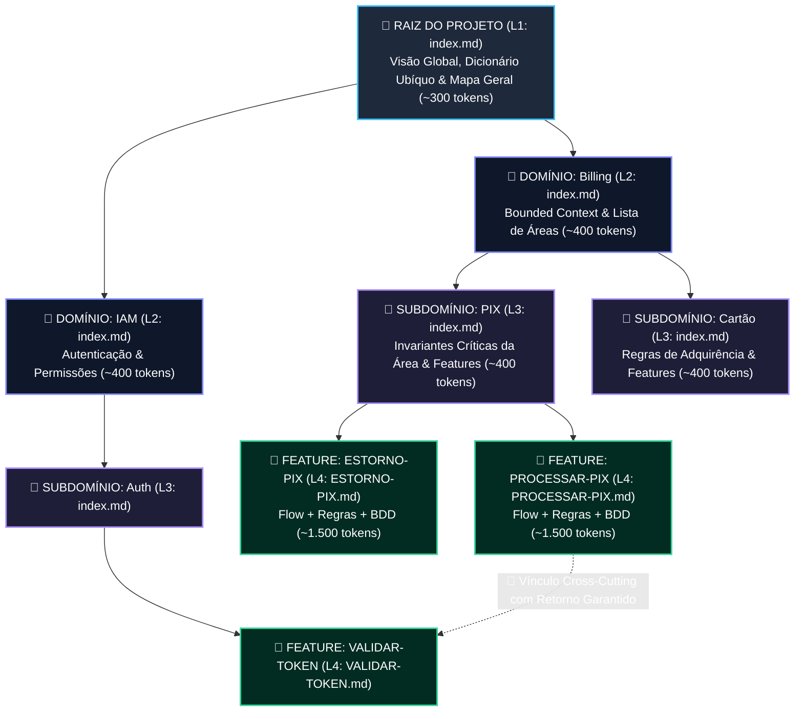
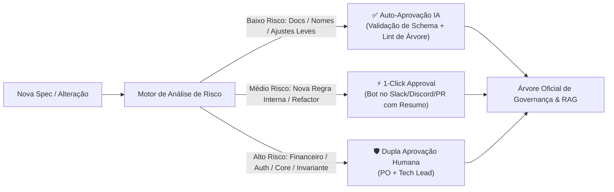

# 🏛️ Spec-Driven Governance System & AI-Context OS

## A Filosofia, Arquitetura e Visão de Produto para Desenvolvimento Guiado por Especificações e IA

---

## 🧭 1. Princípios Fundamentais & Filosofia

> *"Se você não consegue documentar e explicar com clareza, você ainda não entendeu o problema."*
> *"Nenhum conhecimento existe isolado: todo detalhe técnico deve ser um galho conectado à raiz da visão do projeto."*

Na engenharia de software tradicional, a documentação costuma ser tratada como um fardo pós-desenvolvimento (ou simplesmente abandonada). Na era do desenvolvimento com Agentes de IA, essa inversão se tornou insustentável. **O código é apenas o subproduto de uma especificação bem compreendida, validada, conectada e governada.**

### Os 4 Postulados do Sistema:

1. **Spec-First & Intent-Driven**: Nenhuma linha de código de produção é escrita antes que o requisito, o fluxo, as invariantes e os cenários de aceite (BDD) estejam formalizados no nível de maturidade adequado.
2. **Princípio do Continuum Conectado (Zero Órfãos)**: Todo artefato, regra ou feature deve nascer conectado à árvore unificada do projeto. É proibido haver documentos soltos; cada nó descende da raiz e preserva trilha de navegação bidirecional.
3. **Padrões como Checklists Ativos**: Templates não são formulários burocráticos vazios; são listas de checagem técnica e mental que ensinam o time a antecipar casos de borda, concorrência, segurança e resiliência.
4. **Padrão com Especialista Embutido (Skills & Pre-prompts)**: Cada padrão de documento carrega consigo agentes especializados de IA que entrevistam o autor, eliminando a síndrome da folha em branco e garantindo profundidade técnica sênior.

---

## 📈 2. Governança Adaptativa & Níveis de Rigor (*Progressive Specs*)

Para evitar o risco de "Waterfall burocrático" e manter a velocidade em fases iniciais de descoberta (*Discovery/Spikes*), o rigor da especificação acompanha a maturidade da feature e a criticidade do domínio:

```text
┌─────────────────────────────────────────────────────────────────────────────┐
│                       NÍVEIS DE RIGOR DA ESPECIFICAÇÃO                      │
├─────────────────────────────────────────────────────────────────────────────┤
│ 🟢 Nível 1: SPIKE / EXPERIMENTO                                             │
│    - Rápido e exploratório (3 a 5 linhas de intenção conectadas à árvore).  │
│    - Zero burocracia de validação formal.                                   │
│    - Objetivo: Testar hipóteses e validar UX/tecnologia descartável.        │
├─────────────────────────────────────────────────────────────────────────────┤
│ 🟡 Nível 2: FEATURE PADRÃO                                                  │
│    - Resumo Executivo + Fluxo Visual (Mermaid) + 2 a 3 cenários BDD.        │
│    - Validação de schema intermediária e contrato de invariantes.           │
│    - Objetivo: Desenvolvimento seguro do dia a dia de produto.              │
├─────────────────────────────────────────────────────────────────────────────┤
│ 🔴 Nível 3: MISSION-CRITICAL (Core / Financeiro / Auth)                     │
│    - Checklist completo: NFRs, rollback, idempotência, auditoria e LGPD.   │
│    - Auditoria estrita de segurança e invariantes obrigatórias tipadas.     │
│    - Objetivo: Garantir integridade financeira e conformidade regulatória.  │
└─────────────────────────────────────────────────────────────────────────────┘
```

* **Evolução Fluida**: Uma funcionalidade pode nascer como um *Spike (Nível 1)*, provar seu valor com usuários reais e ser promovida gradualmente para *Feature Padrão (Nível 2)* ou *Mission-Critical (Nível 3)* antes de receber escala.

---

## ⚡ 3. Usabilidade sem Fricção: Criação Conversacional (*Voice-to-Spec*)

Desenvolvedores e POs não devem perder tempo preenchendo formulários estáticos manualmente. A interface atua através de **co-criação conversacional orientada**:

```text
👨‍💻 Humano (via áudio ou chat): 
   "Quero criar uma regra para estornar o PIX se o recebedor não confirmar em 24h."

🤖 Especialista Virtual (Fintech Architect):
   "Entendido! Localizei o nó  [Billing > PIX] na árvore do projeto.
    Para fechar o checklist deste padrão, preciso de 2 definições:
    1. A taxa de processamento do gateway deve ser devolvida ou retida?
    2. O estorno dispara evento de webhook, push notification ou ambos?"

👨‍💻 Humano: "1: Devolve a taxa. 2: Dispara ambos."

🤖 Especialista Virtual: 
   "Perfeito! Documento compilado no padrão com Resumo, Flow, BDD e Invariantes, 
    conectado diretamente ao nó [Billing > PIX > ESTORNO-PIX]."
   ⏱️ Tempo total: 40 segundos | 🧠 Carga cognitiva humana: Mínima.
```

---

## 🌳 4. Arquitetura da Árvore Viva: Conectividade Total & Zero Órfãos

Para eliminar a desorientação causada por arquivos soltos e o estouro de contexto de documentos gigantescos, o sistema adota uma **Estrutura em Árvore Contínua em 4 Camadas (L1 a L4)**.



### As 3 Regras de Ouro da Conectividade:

1. **Regra de Paternidade Estrita (*Strict Parentage - Zero Órfãos*)**:
   * É terminantemente proibido criar arquivos soltos.
   * Todo arquivo contém no seu YAML Frontmatter a referência explícita ao seu pai (`parent`) e ao caminho completo da raiz (`breadcrumb`).
2. **Navegação Bidirecional em 1 Clique**:
   * Da raiz (`L1`), é possível percorrer e inspecionar todos os domínios, áreas e features.
   * De qualquer feature (`L4`), é possível retroceder imediatamente até a raiz através do breadcrumb ativo.
3. **Contratos de Invariantes em Nós Intermediários**:
   * Os nós L2 e L3 contêm resumos compactos e uma lista explícita de **Invariantes Críticas**, permitindo que a IA compreenda as restrições inegociáveis de um subdomínio sem precisar carregar todas as features no contexto.

```yaml
# domains/billing/pix/index.md (Nó L3)
parent: "domains/billing/index.md"
breadcrumb: "Projeto > Billing > PIX"
summary: "Processamento de pagamentos instantâneos via webhook do BACEN."
critical_invariants:
  - "idempotency_key: mandatory_header"
  - "max_sla_response_ms: 2000"
  - "night_limit_rejection: automatic_above_1000"
  - "rollback_policy: automatic_on_network_timeout"
children_features:
  - "PROCESSAR-PIX.md"
  - "ESTORNO-PIX.md"
tags: ["pix", "bacen", "tempo-real", "idempotencia"]
```

---

## 🕸️ 5. Malha Conectada: Árvore Oficial + Grafo de Relações (*Cross-Cutting*)

Quando um fluxo de negócio atravessa mais de um domínio (ex: Pagamento depende de Autenticação e gera Notificação), o sistema **não fragmenta o documento nem cria um galho solto**. Ele estabelece um **vínculo transversal com retorno garantido**:

```yaml
# Em domains/billing/pix/PROCESSAR-PIX.md (Camada L4)
parent: "domains/billing/pix/index.md"
breadcrumb: "Projeto > Billing > PIX > PROCESSAR-PIX"

cross_cutting_relations:
  - target_node: "domains/iam/auth/VALIDAR-TOKEN.md"
    nature: "consumes_auth_token"
    contract_mode: "synchronous_rpc"
    return_breadcrumb: "domains/billing/pix/PROCESSAR-PIX.md"
  
  - target_node: "domains/notifications/push/NOTIFICAR-COMPRA.md"
    nature: "triggers_async_receipt"
    contract_mode: "event_driven"
    return_breadcrumb: "domains/billing/pix/PROCESSAR-PIX.md"
```

### O que isso garante:

* **Para o Desenvolvedor / PO**: Navega entre os domínios via links ativos sem perder a âncora do fluxo original.
* **Para a IA / RAG**: Constrói dinamicamente o subgrafo de dependências exatas necessárias para implementar a feature, sem puxar código ou contextos irrelevantes.
* **Garantia Bidirecional**: O sistema gera automaticamente um índice reverso (*Consumer Index*) nos domínios consumidos (`IAM` e `Notifications`), alertando-os sobre quem depende de seus contratos.

---

## 🚦 6. Fluxo de Governança Baseado em Matriz de Risco (*Risk-Tiered Gatekeeper*)

Para eliminar o gargalo de revisão humana (*Review Fatigue*) garantindo que a verdade oficial (*Ground Truth*) permaneça íntegra:



### Auditoria de Conflitos e Invariantes (*Confidence Scoring*):

* 🔵 **Alerta Informativo**: *"O Domínio de Pricing também referencia taxas. Vínculo cross-cutting adicionado automaticamente."* ➔ **Não bloqueia.**
* 🟡 **Alerta de Atenção**: *"Possível concorrência com a feature ESTORNO-PIX ao alterar o saldo."* ➔ **Destaca no diff semântico para o revisor.**
* 🔴 **Violação Rígida**: Quebra de nó pai (órfão), violação de schema ou quebra de invariante estrita. ➔ **Bloqueia o merge.**

### Diff Semântico em 3 Bullets:

O revisor humano não precisa ler centenas de linhas de markdown:

> 📌 **Resumo do Impacto da Mudança:**
>
> 1. Adiciona limite de R$ 1.000 para transações noturnas no PIX (`Billing > PIX`).
> 2. Conecta dependência transversal ao serviço de validação de horário de `Core`.
> 3. Zero alteração em tabelas de banco de dados ou contratos de integração externos.
>    ➔ **[ Aprovar ]** **[ Rejeitar ]**

---

## 🤖 7. Padrões com Especialistas Integrados (*Pattern-Skill Pairing*)

Cada tipo de documento possui seu **molde estrutural (Schema)** e sua **Skill de IA correspondente**:

| Tipo de Padrão                             | Especialista Virtual Associado (Skill) | Checklist Ativo / Pré-prompts                                                     |
| :------------------------------------------ | :------------------------------------- | :--------------------------------------------------------------------------------- |
| **Feature Crítica de Pagamento**     | *Fintech & Security Architect*       | Idempotência, limites BACEN, rollback de transação, concorrência distribuída. |
| **API Contract & Integração**       | *API Design & Protocol Specialist*   | Versionamento semântico, rate-limits, schemas OpenAPI, contratos RFC 7807.        |
| **Mecanismo de Autenticação / IAM** | *Security & Auth Auditor*            | OAuth2/OIDC, rotação de tokens, RBAC/ABAC, auditoria de acesso.                  |
| **Serviço de Background / Workers**  | *Distributed Systems Engineer*       | Dead-letter queues, backoff exponencial, consistência eventual.                   |

---

## 🗄️ 8. Base de Conhecimento Conectada & RAG Estruturado

A plataforma mantém uma base local/central indexando cada nó com sua árvore de parentesco e metadados:

```json
{
  "id": "billing-pix-processar",
  "version": "1.0.0",
  "status": "APPROVED",
  "approved_by": "marcos@empresa.com",
  "approved_at": "2026-08-27T20:30:00Z",
  "breadcrumb": "Projeto > Billing > PIX > PROCESSAR-PIX",
  "parent": "domains/billing/pix/index.md",
  "layer": "L4_ITEM",
  "summary": "Processamento assíncrono de mensagens PIX via webhook com garantia de idempotência e SLA < 2s.",
  "path": "domains/billing/pix/PROCESSAR-PIX.md",
  "cross_cutting": ["domains/iam/auth/VALIDAR-TOKEN.md", "domains/ledger/account/ATUALIZAR-SALDO.md"],
  "tags": ["pagamentos", "pix", "tempo-real", "idempotencia"]
}
```

---

## 🔄 9. Evolução de Padrões, Ciclo de Vida e Anti-Drift

1. **Combate ao Desvio (*Spec-Drift Gate*)**:
   - A pipeline de CI/CD compara a AST do código gerado com os cenários BDD e as invariantes da spec.
   - Qualquer método, rota ou lógica implementada sem cobertura na spec conectada bloqueia a compilação.
2. **Ciclo de Vida da Feature (Lifecycle: Spike $\to$ Active $\to$ Deprecated $\to$ Sunset)**:
   - Features arquivadas ou descontinuadas recebem a tag `status: DEPRECATED` e ponteiros para a feature substituta, mantendo a história da árvore sem poluir o RAG ativo dos agentes.
3. **Migração em Lote de Schemas (Batch LLM Refactor)**:
   - Agente de manutenção atualiza templates e insere novas seções obrigatórias (ex: LGPD) gerando PR de migração unificado.

---

## 🚀 10. A Visão de Produto SaaS (*AI-Native Spec & Context OS*)

Esta metodologia resolve a maior dor do mercado corporativo moderno de software e está pronta para ser empacotada como uma plataforma SaaS B2B:

```text
┌─────────────────────────────────────────────────────────────────────────────┐
│                    CONTEXT & SPEC GOVERNANCE PLATFORM                       │
├─────────────────────────────────────────────────────────────────────────────┤
│ 🌳 Visual Tree Navigator (Navegação hierárquica conectada estilo Notion)    │
│ 🎨 Studio de Padrões & Schemas (Crie, valide e versione os templates)      │
│ 🤖 Especialistas & Skills por Padrão (Entrevistas guiadas via voz/chat)     │
│ 🚦 Gatekeeper Inteligente por Risco (Diff Semântico + 1-Click Approval)     │
│ 🔌 AI Gateway & MCP Server (Conexão nativa com Cursor, Antigravity, etc.)   │
└─────────────────────────────────────────────────────────────────────────────┘
```

### Casos de Uso Multi-negócio:

* **Projetos de Tecnologia Pura**: Microsserviços, plataformas de dados, infraestrutura distribuída.
* **Projetos Tech + Produto (SaaS/Apps)**: Jornadas de usuário, regras de precificação, checkout e retenção.
* **Projetos Tech + Serviços**: Consultorias e software houses que precisam padronizar entregas com qualidade sênior, rastreabilidade total e zero retrabalho.
